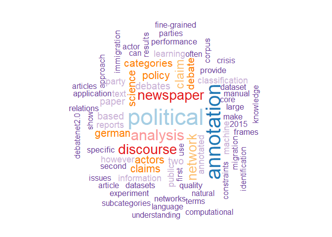

### About me

I am a post-doctoral researcher in an interdisciplinary research project
spanning political science and natural language processing at the
*Research Center on Inequality and Social Policy* (University of Bremen,
Germany). My research interest is in computational policy analysis using
methods of social network analysis and NLP.

*\[July 2023\]* After five years of dedicated academic research I have
made the decision to transition beyond academia. I look forward to
applying my expertise in data-driven methodologies and computational
social science outside of traditional research settings.

*During this period of transition I may not be able to actively maintain
or update my repositories.*

<!-- -->
